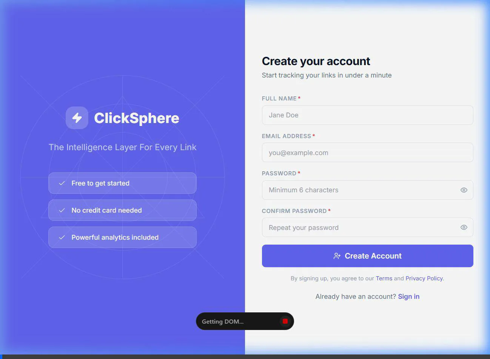
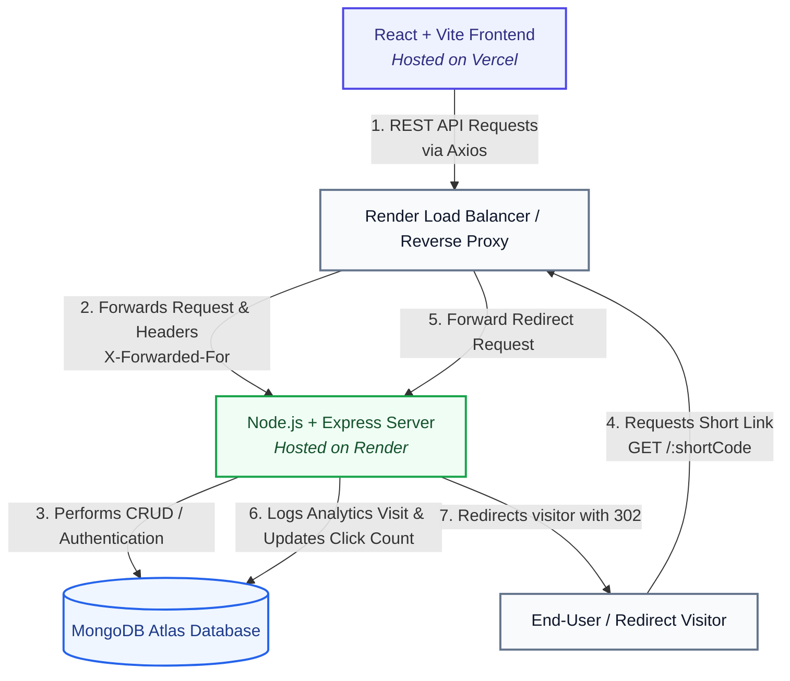

# 🌌 ClickSphere

> **The Intelligence Layer For Every Link**
>
> A production-ready, high-performance, and visually stunning MERN stack URL shortener built with modern web aesthetics, robust security practices, and comprehensive click analytics.

---

## 📽️ Application Demonstration & Video Walkthrough

### 🔗 Video Links
*   [Watch the Loom Video Walkthrough (Placeholder)](https://www.loom.com/share/247191da16a542abb0cfd0ad49c43c95)

### 🚀 Verified Signup and Dashboard Flow (Local Demonstration)
Here is an animated recording showing the user signup, API integration, and redirection to the interactive dashboard:



---

## 🏗️ Application Architecture

The following diagram illustrates the request lifecycle, data flow, and components of the ClickSphere ecosystem:



---

## ✨ Features

{{ ... }}

## 📂 Project Structure

```text
clicksphere/
├── assets/                      # Application screenshots and animations for documentation
├── client/                      # React Frontend (Vite)
│   ├── public/                  # Static assets
│   └── src/
│       ├── api/                 # Axios custom instance and configuration
│       ├── components/          # Reusable component library
{{ ... }}

## 🛠️ Setup and Installation

### Prerequisites
*   [Node.js](https://nodejs.org/) (v18 or higher recommended)
*   [MongoDB](https://www.mongodb.com/) (running locally or a remote MongoDB Atlas connection URI)

### 1. Environment Variables Configuration

Create a `.env` file in both the `client/` and `server/` directories:

#### For Backend (`server/.env`):
```env
PORT=5000
MONGO_URI=mongodb+srv://<username>:<password>@cluster.mongodb.net/clicksphere?retryWrites=true&w=majority
JWT_SECRET=your_super_secret_jwt_key_for_production
CLIENT_URL=http://localhost:5173
BASE_URL=http://localhost:5000
NODE_ENV=development
```
*(In production, set `CLIENT_URL` to your Vercel deployment URL and `NODE_ENV` to `production`)*

#### For Frontend (`client/.env`):
```env
# Point to the Express backend URL. The axios client automatically handles trailing slashes.
VITE_API_URL=http://localhost:5000/api
VITE_BASE_URL=http://localhost:5000
```
*(In production, set `VITE_API_URL` to your Render API address, e.g. `https://clickshare-6ccz.onrender.com/api`)*

### 2. Install Dependencies

Install packages in both directories:

{{ ... }}

---

## 🚀 Running the Application

### Local Development Flow

You can run both servers in parallel:

#### Start Backend API Server:
```bash
cd server
npm run dev
```
*The server will start on [http://localhost:5000](http://localhost:5000) and watch for file modifications.*

#### Start React Vite Dev Server:
```bash
cd client
npm run dev
```
*The frontend application will be hosted on [http://localhost:5173](http://localhost:5173).*

---
{{ ... }}
*   `GET /url/:urlId` - Get detailed click trend over time, device/browser distributions, and location analytics for a specific link (Protected).

### Redirection (Public)
*   `GET /:shortCode` - Resolves and logs public visits, updating click metrics and geographics, before redirecting visitors.

---

## 📝 Assumptions Made During Implementation

1.  **MongoDB Network Security**: We assume that database connection failures in production are resolved by whitelisting Render's IP block on MongoDB Atlas. Since Render outbound IPs are dynamic, whitelisting access from anywhere (`0.0.0.0/0`) is required.
2.  **Reverse Proxy Infrastructure**: Since the API is hosted behind Render's reverse proxy, we assume that requests route through standard load balancers. Therefore, `app.set('trust proxy', 1)` is required to track client IPs accurately rather than rate-limiting the load balancer.
3.  **Vercel Deployments & CORS**: Vercel utilizes random subdomains for branch preview deployments. We assume CORS should accommodate preview builds seamlessly, so we implemented regex origin matching to dynamically allow any `.vercel.app` subdomain in CORS preflight filters.
4.  **Base URL Resiliency**: Environment configuration mismatches (e.g. omitting `/api` from `VITE_API_URL`) are common. We assumed frontend API calls must remain resilient; the custom axios client was configured to automatically normalize and append `/api` if missing.

---

## 🧠 AI Planning & Audit Log (Hackathon Fixes)

This project has been updated during the hackathon following an engineering audit to resolve production-level issues:

### 1. Issue Audited: Registration Failures in Production
*   **Root Cause**: CORS mismatches occurred because the backend's allowed origin in environment variables (`CLIENT_URL`) was incorrectly set to the Vercel dashboard administration URL instead of the actual frontend application address.
*   **Fix**: Standardized CORS configuration to parse comma-separated lists of URLs, strip trailing slashes, and dynamically whitelist localhost and any `.vercel.app` subdomains.

### 2. Issue Audited: Rate Limiter Blocking All Users
*   **Root Cause**: When behind a reverse proxy (like Render), `express-rate-limit` checked the load balancer's IP instead of the user's IP, triggering rate limits globally.
*   **Fix**: Added `app.set('trust proxy', 1)` to Express.

### 3. Issue Audited: "Cannot GET /" on Render
*   **Root Cause**: No fallback root route (`/`) existed on the server, causing Express to respond with "Cannot GET /" when the Render URL was visited directly.
*   **Fix**: Created a friendly root route `GET /` returning API health status and a welcome message.

### 4. Issue Audited: 500 Responses for Validation & Mongoose Errors
*   **Root Cause**: Controller catch blocks returned status `500` manually, bypassing custom Express error handling for validation and duplicate keys.
*   **Fix**: Forwarded all catch-block exceptions using `next(error)`, returning correct `400` and `409` HTTP statuses.

---

This project is a part of a hackathon run by https://katomaran.com
#   c l i c k s h a r e 
 `GET /:shortCode` - Resolves and logs public visits, updating click metrics and geographics, before redirecting visitors.

This project is a part of a hackathon run by https://katomaran.com
#   c l i c k s h a r e
